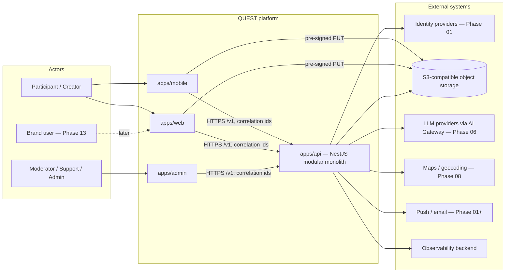

# 01 — System Context

QUEST is a participation network: people discover, accept, do, prove, achieve and share real-world
Quests. The system boundary is the QUEST platform (mobile, web, admin, API, workers). Everything
outside is an external system reached through an adapter.

Trust boundaries: (1) public internet → CloudFront/WAF → ALB → API; (2) API → data tier (private
subnets, TLS); (3) API → AI providers (only through `packages/ai`, redacted, budgeted); (4) client
devices are untrusted — every rule is enforced server-side; clients hold only short-lived tokens in
secure storage.

Phase 00 status: all four applications exist as runnable shells; the API serves `/health`,
`/ready`, `/v1/system/info`; no identity provider, AI provider, maps or push integration is wired yet.
