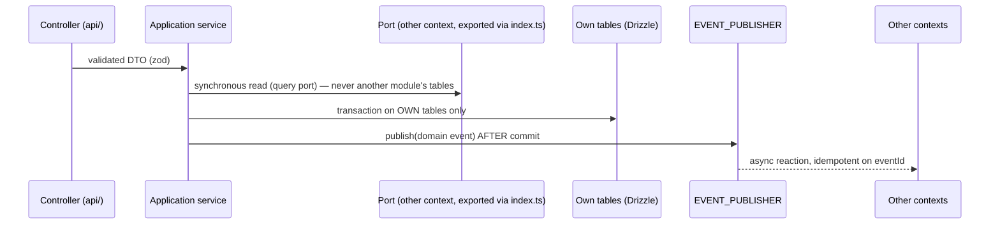

# 04 — Domain Architecture

## Bounded contexts and ownership

| Context                         | Owns (data)                                                                | Phase    | Phase 00 artefact                                                                            |
| ------------------------------- | -------------------------------------------------------------------------- | -------- | -------------------------------------------------------------------------------------------- |
| Identity                        | accounts, credentials, sessions, devices, roles, consents, deletion/export | 01 ✅    | `modules/identity` — exports `PRINCIPAL_RESOLVER`, `AccountDeletionJob`, `DataExportService` |
| Profiles                        | public profile, interests/onboarding, privacy settings, blocks             | 01 ✅    | `modules/profiles` — exports `PROFILE_PROVISIONER`, `PROFILE_QUERY`, `BLOCK_QUERY`           |
| Quest                           | quest definitions, versions, categories, safety state ref                  | 02       | `SafetyAssessment` contract                                                                  |
| Participation                   | acceptance/progress state machine                                          | 02       | —                                                                                            |
| Proof                           | evidence references, verification records                                  | 05       | `analyzeProof` capability shape                                                              |
| Gamification / Quest Passport   | XP ledger, badges, levels, streaks                                         | 04       | —                                                                                            |
| Social Graph                    | follows, blocks, mutes, comments, reactions                                | 03       | —                                                                                            |
| Crews                           | crews, membership, roles                                                   | 09       | —                                                                                            |
| Feed / Discovery                | ranking inputs and outputs                                                 | 07       | `rankRecommendations` shape                                                                  |
| Notifications                   | preferences, delivery log                                                  | 01+      | —                                                                                            |
| Location                        | coarse/precise location policy, geo entities                               | 08       | classification rules (docs)                                                                  |
| Creators / Brands / World Quest | creator status, campaigns, world quests                                    | 11/13/10 | —                                                                                            |
| Trust & Safety / Moderation     | assessments, cases, appeals, sanctions                                     | 00/02/14 | `trust-safety` module, fail-closed                                                           |
| Analytics                       | event taxonomy, consent-gated sinks                                        | 15       | `@quest/analytics` contract                                                                  |
| AI Intelligence                 | tasks, prompts, invocation audit                                           | 06       | `@quest/ai` contracts                                                                        |
| System                          | build/version info                                                         | 00       | `system` module                                                                              |

## Interaction patterns

Rules (normative, enforced by dependency-cruiser where mechanical):

1. A context owns its tables; it is the only writer. Cross-context reads go through the other
   context's exported query port; cross-context reactions go through domain events.
2. No synchronous call may cause a write in another context (use an event or a command port owned
   by the target context with an explicit ADR if unavoidable).
3. Business rules live in `domain/` and `application/`; controllers map HTTP ↔ DTOs only; clients
   (mobile/web/admin) never re-implement business rules — they render server decisions.
4. Every state transition that affects safety, rewards or visibility is recorded append-only
   (assessments, ledgers, verification records), never mutated in place.
5. Quest publication requires a fresh, publishable `SafetyAssessment` (see 10_TRUST_SAFETY).

The quest lifecycle (`quest-domain` skill) — discover → accept → start → perform → submit proof →
verify → reward → share/challenge — spans Quest, Participation, Proof, Gamification and Social and
is implemented phase by phase against these rules.
