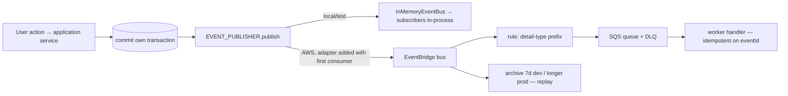

# 07 — Event Architecture

## Envelope (`packages/events`, implemented and tested)

```json
{
  "eventId": "uuid", "eventType": "quest.proof.submitted", "eventVersion": 1,
  "occurredAt": "2026-09-04T18:20:11.123Z",
  "aggregateType": "QuestParticipation", "aggregateId": "…",
  "correlationId": "…", "causationId": "…", "actorId": "user-id-only",
  "source": "api.participation", "dataClassification": "INTERNAL",
  "payload": { "…identifiers and facts, never profiles…" }
}
```

- Naming `<context>.<aggregate>.<past-tense-action>`; validated by `defineEvent`.
- `eventVersion` bumps on breaking payload changes; consumers ignore unknown fields and reject
  newer-than-supported versions (`parseEvent`).
- `dataClassification` gates what may leave the process; `RESTRICTED` (precise location, evidence)
  never travels in events — only references.

## Catalogue (Phase 01)

`packages/events/src/catalog/identity.ts`: `identity.account.registered`, `email-verified`,
`deactivated`, `reactivated`, `suspended`, `reinstated`, `deletion-requested`, `deletion-cancelled`,
`deleted` (terminal — every context erases its data), `role-granted`, `role-revoked`,
`sessions-revoked`; `profiles.profile.updated`. Payloads are ids, age band, country and language
only (tested). Publishing happens after the owning transaction commits.

## Flow



## Guarantees and rules

- At-least-once delivery; handlers deduplicate on `eventId` (test proves redelivery semantics).
- Publish only after commit; a transactional outbox is introduced with the first cross-process
  consumer (Phase 05 media pipeline at the latest) — recorded in BACKLOG.
- Failures: local bus isolates handler failures and reports them (logged); AWS: SQS redrive to DLQ
  after `max_receive_count`, DLQ-not-empty alarm (Terraform `modules/messaging`).
- Retries are a queue concern (visibility timeout / redrive), never a loop inside the handler.

## Event catalogue (planned, by phase — none exist yet besides the test fixture)

`identity.account.created|deleted`, `profile.profile.updated`, `quest.quest.created|published|archived`,
`participation.participation.accepted|started|completed`, `proof.evidence.submitted|verified|rejected`,
`gamification.reward.issued`, `social.user.followed|blocked`, `crew.member.joined`,
`safety.assessment.recorded`, `moderation.case.opened|decided`.
