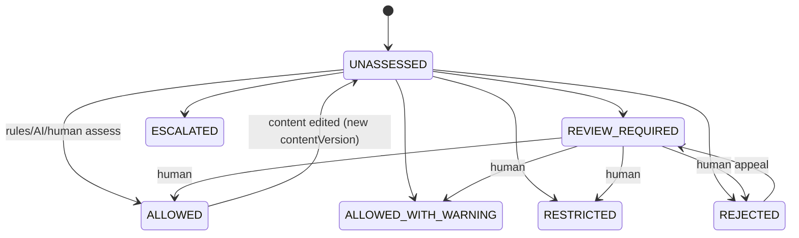

# 10 — Trust & Safety Architecture

Canonical policy: [`docs/security/QUEST_SAFETY_BASELINE.md`](../security/QUEST_SAFETY_BASELINE.md).

Enforcement contract implemented in Phase 00 (`@quest/types`, `apps/api/modules/trust-safety`):

- `SafetyPolicyState` (7 states), `SafetyRiskCategory` (16 categories including all 13 mandated),
  `SafetyAssessment` (append-only, versioned by `subjectContentVersion`, `policyVersion`, `decidedBy`).
- `canPublishWithSafetyState()` / `canPublishWithAssessment()` — deterministic publish rule:
  only `ALLOWED`, `ALLOWED_WITH_WARNING`, `RESTRICTED`; stale or missing assessments block.
- `SafetyDecisionPort` with Phase 00 `FailClosedSafetyDecision` (everything → `REVIEW_REQUIRED`).
  Phase 02 must inject `SAFETY_DECISION` before any publish transition and persist the
  `assessmentId` it relied on; tests prove the fail-closed output can never satisfy the rule.
- Reporting, moderation queues, appeals and sanctions are Phase 03/14 features built on the same
  records; the admin `AdminPermission` vocabulary already reserves the moderation permissions.
