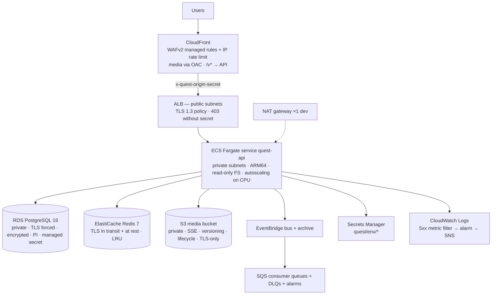

# 11 — Deployment Architecture

Defined in `infrastructure/terraform` (modules + `environments/dev`); nothing is applied yet.

Environment awareness: `var.environment` drives multi-AZ, Fargate Spot, deletion protection,
backup retention and Redis node count. Region per ADR-008 (`me-central-1`), overridable per
environment. Remote state is S3 with partial backend config (no account values committed).

Container image: `apps/api/Dockerfile` (multi-stage, pnpm deploy, non-root, healthcheck) — built and
pushed by a deploy workflow to be added when the first environment is provisioned (out of Phase 00
scope by requirement).

Migrations in deployment: run `node dist/cli/migrate.js up` as a one-off ECS task (same image) before
rolling the service; `node dist/cli/migrate.js status` is the post-deploy check.

Runtime configuration: plain env vars from Terraform; `DATABASE_URL`/`REDIS_URL` assembled by the
deploy pipeline from module outputs and the RDS-managed secret; application secrets injected from
Secrets Manager ARNs via the task execution role.
