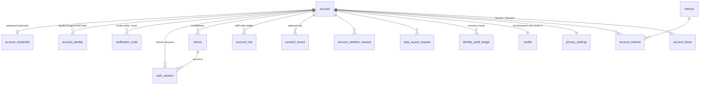

# Identity & Profiles — data model (Phase 01)

Migration: `apps/api/drizzle/0001_identity_profiles.sql` (source of truth, with index rationale and
rollback). Drizzle definitions: `apps/api/src/infrastructure/database/schema/{identity,profiles}.ts`.
Conventions from `docs/architecture/05_DATA_ARCHITECTURE.md` apply (UUID v7 keys generated in the
application, `timestamptz`, `quest_set_updated_at` trigger, text + CHECK for enums, every FK indexed,
`ON DELETE RESTRICT`).

## Aggregates and ownership

| Aggregate (owner module)            | Tables                                                                                                           | Writer                                                          |
| ----------------------------------- | ---------------------------------------------------------------------------------------------------------------- | --------------------------------------------------------------- |
| ACCOUNT (`modules/identity`)        | `account`, `account_role`, `consent_record`, `account_deletion_request`, `data_export_request`                   | `AccountRepository`, `LifecycleRepository`                      |
| AUTHENTICATION (`modules/identity`) | `account_credential`, `account_identity`, `verification_code`, `auth_session`, `device`, `identity_audit_ledger` | `AccountRepository`, `SessionRepository`, `LifecycleRepository` |
| PUBLIC PROFILE (`modules/profiles`) | `profile`, `interest`, `account_interest`, `privacy_settings`, `account_block`                                   | `ProfileRepository` only                                        |

Identity → Profiles calls go through `PROFILE_PROVISIONER` (provision at registration,
`setAccountActive` on every lifecycle transition, `eraseAccount` in the deletion cascade) and
`PROFILE_QUERY` (onboarding facts, username for support). Profiles never reads Identity tables;
it receives the age band and verified flag through the `Principal`.

## Key design points

- **Immutable identity**: `account.id` (UUID v7) is the only key other tables reference. `email` and `profile.username` are attributes with partial unique indexes (`account_email_live_uidx` on `lower(email) WHERE deleted_at IS NULL`, `profile_username_uidx WHERE username IS NOT NULL`).
- **State machine** in the database: `account.state` CHECK + `account_email_lifecycle_check` (DELETED ⇔ email NULL and tombstone present). Transitions are only made through `transitionAccount()` (`@quest/types` `ACCOUNT_TRANSITIONS`).
- **Profile visibility mirror**: `profile.account_active` is maintained by Identity in the same transaction as every state change so public reads need no cross-context join.
- **Sessions**: `refresh_token_hash` (unique) + `previous_refresh_token_hash` (indexed) implement rotation and reuse detection; `refresh_generation` is the compare-and-set counter; `absolute_expires_at` bounds session life; `auth_session_account_live_idx` serves the sessions list and revoke-all.
- **Roles ledger**: one active grant per `(account_id, role)` via a partial unique index; revoked grants are kept.
- **Consents**: insert-only; the latest row per type is the current decision (`consent_record_account_type_idx`).
- **Codes**: `verification_code_live_idx` finds the live code per purpose; issuing a new code consumes the previous one.
- **Interests**: reference table `interest` seeded idempotently by the migration (`ON CONFLICT DO NOTHING`); `account_interest` is replaced atomically per update.
- **Blocks**: composite PK `(blocker, blocked)`, `CHECK blocker <> blocked`, reverse index for "who blocked me".
- **Audit ledger**: `jsonb` metadata restricted by the application to low-cardinality primitives; no PII beyond ids.

## Deletion cascade (account deletion request architecture)

1. `POST /v1/me/deletion-request` (re-authenticated) → `account_deletion_request` PENDING with `scheduled_for = now + 30 days`; state `DELETION_REQUESTED`; profile hidden; other sessions revoked; e-mail notice; event `identity.account.deletion-requested`.
2. During the grace period the user may sign in and `POST /v1/me/deletion-request/cancel` → the state recorded in `previous_state` is restored (`PENDING_VERIFICATION` stays unverified; `SUSPENDED` stays suspended; `ACTIVE`/`DEACTIVATED` → `ACTIVE`), profile visible again only when `ACTIVE`; event `identity.account.deletion-cancelled`. Staff may suspend an account during the grace period: the request stays `PENDING` but is paused (the job deletes only `DELETION_REQUESTED` accounts) and resumes when the account is reinstated (`RESUME_DELETION`).
3. `AccountDeletionJob.processDue()` (CLI `identity:process-deletions`; scheduled worker with the first deployment, TD-21) executes, per account, **one transaction**:
   - hard delete: `auth_session`, `device`, `account_credential`, `account_identity`, `verification_code`, `data_export_request`;
   - revoke all `account_role` grants (rows kept);
   - Profiles `eraseAccount`: interests, privacy settings and blocks deleted, profile columns nulled, `erased_at` set, avatar object deleted;
   - `account`: `email → NULL`, `email_tombstone = sha256(email)`, `date_of_birth → 1900-01-01`, `state = DELETED`, `deleted_at`, request reason and every suspension field cleared;
   - request `COMPLETED`; audit `DELETION_COMPLETED`.
4. After commit: every export bundle object the account produced is deleted; `identity.account.deleted` published. **Every other context must subscribe** and erase its own account-linked data idempotently (the event may be redelivered). Phase 02+ contexts add their handler when they add their first account-linked table; the phase gate checks for it.
5. Retained on purpose (legal basis, ids only): `consent_record`, `account_role` history, `identity_audit_ledger`, `account_deletion_request`.

Idempotency: a completed request or a non-`DELETION_REQUESTED` account is skipped; re-running the job is safe (INT "requests, cancels and finally executes…").

## User-data export contract

- Request: `POST /v1/me/data-export` (verified email, ≥ 24 h apart, one open request) → `data_export_request` REQUESTED.
- Fulfilment: `DataExportService.processOpen()` (CLI `identity:process-exports`, worker later) collects one section per registered `DataExportContributor` (`infrastructure/data-export`), validates the bundle against `dataExportBundleSchema` (`bundleVersion` 1) and stores `exports/<accountId>/<exportId>.json` (private, 7-day expiry) → READY + e-mail notice.
- Sections today: `identity` (account facts incl. email and DOB — the user's own data —, roles, linked providers, consents, live sessions, devices without tokens, security events) and `profiles` (profile, interests, privacy settings, blocks). New contexts register a contributor in `onModuleInit`.
- Never in a bundle: password hashes, token hashes, verification codes, push tokens, other users' personal data (INT "produces a downloadable data-export bundle…"). The `profiles` section lists the account ids the user has blocked (the user's own action; opaque ids, no names) by design.
- Fulfilment is crash-safe: a `PROCESSING` item whose `started_at` is older than 15 minutes is re-picked by the next worker run and no longer blocks a new request.
- Download: `GET /v1/me/data-export/:id` returns a 15-minute pre-signed URL while READY. Expiry is enforced three ways: on read, by the worker sweep (`processOpen` → `expireDue`), and by the bucket lifecycle rule on `exports/` (7 days, `infrastructure/terraform/modules/s3-media`).

## Retention jobs (to schedule with the first deployment — TD-26)

`SessionRepository.purgeExpiredSessions(olderThan)` for sessions past absolute expiry; audit-ledger aggregation after 24 months; expired export objects (storage lifecycle rule on `exports/`).
