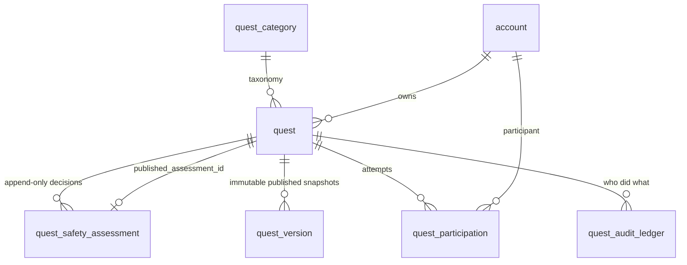

# Quest — data model (Phase 02)

Migration: `apps/api/drizzle/0002_quest_core.sql` (source of truth, with index rationale and
rollback). Drizzle definitions: `apps/api/src/infrastructure/database/schema/quests.ts` — a mirror,
not a second source of truth, but a complete one: drizzle-kit computes its next snapshot from that
file, so an index or CHECK missing there would be dropped by the next generated migration. An
integration test compares the mirror against the migrated database
(`test/integration/database.int.test.ts`, "keeps the Drizzle schema mirror in step").

Conventions from `docs/architecture/05_DATA_ARCHITECTURE.md` apply: UUID v7 keys generated in the
application, `timestamptz`, the `quest_set_updated_at` trigger, text + CHECK for enums, every FK
indexed, `ON DELETE RESTRICT`.

## Aggregates and ownership

| Aggregate (owner module)            | Tables                                                           | Writer                    |
| ----------------------------------- | ---------------------------------------------------------------- | ------------------------- |
| QUEST (`modules/quests`)            | `quest`, `quest_category`, `quest_version`, `quest_audit_ledger` | `QuestRepository`         |
| SAFETY DECISIONS (`modules/quests`) | `quest_safety_assessment`                                        | `QuestRepository`         |
| PARTICIPATION (`modules/quests`)    | `quest_participation`                                            | `ParticipationRepository` |

The Quest context owns only these tables. It reads no identity or profile table — a
dependency-cruiser rule (`quests-must-not-read-identity-or-profile-tables`) makes that mechanical.
Owner facts arrive through `ACCOUNT_FACTS` (Identity), profile cards and blocks through
`PROFILE_QUERY` / `BLOCK_QUERY` (Profiles), and safety decisions through `SAFETY_DECISION`
(Trust & Safety). No date of birth ever enters this context; the Quest layer sees a coarse age
band and nothing finer.

## `quest`

The aggregate root. Its columns fall into four groups, and the grouping is the design.

**Identity and ownership.** `id` is an immutable UUID v7 (ADR-011). `owner_account_id` is derived
from the authenticated principal on creation and never appears in any request schema; there is no
transfer path in Phase 02.

**Safety-relevant content.** `title`, `summary`, `instructions`, `safety_notes`, `category_key`,
`difficulty`, `evidence`, `eligibility`, `location_country_code`, `location_label`. `content_hash`
is SHA-256 over the canonical serialisation of exactly these fields (`canonicalQuestContent`,
ADR-013). Location is deliberately coarse — a country code and a human label. No coordinates are
stored in Phase 02, so a Quest cannot become a way to point a stranger at a precise place.

**Duration, as three separate concepts.** `effort_minutes` is how long doing it should take;
`completion_window_hours` is how long a participant has after starting; `available_from` /
`available_until` is when the Quest may be discovered and accepted at all. They are separate
columns because they answer different questions and conflating them produces a field that means
whichever one the reader assumed. None of them is in the content hash: changing a time estimate is
not a safety change.

**Publication proof.** `published_version`, `published_content_hash`, `published_assessment_id`,
`published_at` and `published_minimum_age_band`. Together they are the evidence that this Quest is
allowed to be visible, and `quest_published_requires_assessment` refuses any `PUBLISHED` row that
is missing any of them or whose published hash differs from its current content hash.

`published_minimum_age_band` is denormalised on purpose: it is the band the Quest was _published_
with, after any tightening the safety decision imposed. Eligibility and visibility are evaluated
against it, never against the `eligibility` column, which is editable draft content and may already
say something looser.

### Lifecycle

`DRAFT → IN_REVIEW → PUBLISHED → ARCHIVED`, plus `SUSPENDED` (staff) and `ERASED` (terminal). The
transition table lives in `packages/types/src/quest/lifecycle.ts` and is the single source of
truth; services route every state change through `transitionQuest` rather than assigning a state.

Three entries in that table carry most of the safety weight:

- `PUBLISHED --REVISE--> DRAFT`. A safety-relevant edit takes a Quest out of visibility in the same
  transaction that writes the edit.
- `IN_REVIEW` has no `PUBLISH`. A Quest that a decision sent to review can only reach visibility by
  being re-assessed favourably or revised — never by asking again.
- `SUSPENDED --REINSTATE--> DRAFT`. Staff reinstatement never restores visibility; the owner has to
  pass the gate again. The suspension also records a blocking decision of its own, so the
  pre-suspension approval cannot be reused.

## `quest_safety_assessment`

Append-only. A reconsideration inserts a new row that supersedes the previous one; nothing is ever
mutated, because a safety decision that can be edited is not an audit trail.

`content_hash` is `NOT NULL` and is the whole mechanism: a decision is about one exact version of
the content, and an edit makes it stale by definition rather than by anyone remembering to
invalidate it.

`seq` is a `bigserial`. "Which decision is current" is a safety question, and neither `assessed_at`
(which defaults to transaction _start_ time) nor the client-generated `id` orders two concurrent
decisions correctly, so the sequence answers it.

`signals[].rationale` values come from a fixed lexicon, never from user text. That is what makes it
safe to keep assessments after an account is erased: they carry a hash and a category, not
anything a person wrote.

## `quest_version`

An immutable snapshot of the content and terms as published, written in the same transaction as the
publication. `quest_participation.quest_version` points at it, which is how a participant's terms
stay fixed: when they press start, the completion window comes from the version they accepted, not
from whatever the owner has since changed the row to say.

## `quest_participation`

One row per attempt. `quest_participation_active_uidx` is a partial unique index on
`(quest_id, account_id) WHERE state IN ('ACCEPTED', 'STARTED')`: the database, not the application,
guarantees one active attempt per person per Quest, so a double-tap is a 409 rather than a second
attempt.

`ACCEPTED → STARTED → COMPLETION_REQUESTED` is where Phase 02 stops. There is no verification, no
reward and no XP: `COMPLETION_REQUESTED` means "the participant says they did it and evidence is
now required", and everything after that belongs to Phase 05.

The expiry sweep (`ParticipationService.expireDue`, CLI `quests:process-expiries`) moves `STARTED`
attempts past their window to `EXPIRED`. It re-reads each row under lock and re-checks the state
and the deadline, so running it twice is harmless.

## `quest_audit_ledger`

Ids, enums and short reasons — who did what to which Quest. It carries the free text of a staff
suspension reason, because the reason column on the Quest row is cleared when the sanction is
lifted and the ledger is then the only durable record of why a Quest was taken down.

It retains `actor_id` for accounts that have since been deleted, on the same legal basis as the
Phase 01 ledgers listed in `docs/data/IDENTITY_DATA_MODEL.md`: the record that a moderation action
happened is the point of the ledger. What erasure does remove is the _live_ attribution — an erased
moderator's id and reason are cleared from `quest.suspended_by` and `quest.suspension_reason`.

## Indexes

| Index                              | Serves                                                       |
| ---------------------------------- | ------------------------------------------------------------ |
| `quest_discovery_idx` (partial)    | The discovery keyset scan; partial on `PUBLISHED` + `PUBLIC` |
| `quest_owner_idx`                  | `GET /v1/quests/mine`, keyset-paged newest first             |
| `quest_category_idx` (partial)     | Category-filtered discovery                                  |
| `quest_suspended_by_idx` (partial) | Clearing sanctions when a staff account is erased            |
| `quest_assessment_latest_idx`      | "The current decision", by `seq`                             |
| `quest_assessment_hash_idx`        | "Has this exact content been assessed?"                      |
| `quest_version_uidx`               | One row per `(quest, version)`                               |
| `quest_participation_active_uidx`  | The one-active-attempt invariant                             |
| `quest_participation_account_idx`  | `GET /v1/me/participations`                                  |
| `quest_participation_expiry_idx`   | The expiry sweep; partial on `STARTED`                       |
| `quest_audit_quest_idx`            | The support view's history                                   |
| `quest_audit_type_time_idx`        | "How many Quests were suspended this week"                   |

## Account lifecycle

**Export.** The Quest context registers a contributor with the export registry and contributes a
`quest` section: the Quests the account wrote and the attempts they made, bounded at 1000 rows per
collection with the truncation reported per collection.

**Erasure.** The context registers an erasure contributor which runs _inside_ the Identity deletion
transaction (`apps/api/src/infrastructure/account-erasure/`). Doing it there rather than in an
`identity.account.deleted` handler means a context that fails to erase aborts the cascade instead of
stranding personal data behind an account that reports itself deleted; the cascade refuses to run at
all if a required contributor has not registered.

Per account:

- their own attempts are deleted outright;
- sanctions they issued as staff have `suspended_by` and `suspension_reason` cleared from other
  people's Quests;
- each Quest they own is driven to `ERASED`: text columns tombstoned, the `evidence` and
  `eligibility` JSONB replaced (they carry owner-authored free text), version snapshots deleted,
  publication proof cleared, content hash replaced with a value that can never match an assessment,
  and any active attempt by another account cancelled;
- assessments are kept, because they carry no personal data and are the record that a decision was
  made.

Quests are erased in bounded, row-locked batches: an unbounded loop inside the deletion transaction
made a large account impossible to delete at all. The rows are locked before anything depends on
them, in `id` order, matching the lock order the staff and owner withdrawal paths use.

## Rollback

The migration's footer documents the reverse. Dropping the Quest tables is safe with respect to
Phase 01: nothing in Identity or Profiles references them.
