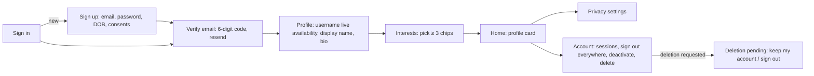

# Mobile onboarding & profile UX (Phase 01)

Implemented in `apps/mobile` (expo-router). Routing is derived from the server's `AccountView`
(`routeForAccount`, `src/features/onboarding/routing.ts`) so the client never re-implements
onboarding rules; the API decides what is missing.

## Flow

| Screen           | Route                       | Notes                                                                                                                     |
| ---------------- | --------------------------- | ------------------------------------------------------------------------------------------------------------------------- |
| Sign in          | `(auth)/sign-in`            | email + password; link to sign up; errors localised by API code                                                           |
| Sign up          | `(auth)/sign-up`            | client pre-validation with the shared zod contracts; optional consents default OFF (never pre-ticked); minimum age stated |
| Verify email     | `(onboarding)/verify-email` | one-time-code keyboard, resend with cooldown feedback, switch account                                                     |
| Profile          | `(onboarding)/profile`      | username availability checked live (400 ms debounce), reserved/taken feedback                                             |
| Interests        | `(onboarding)/interests`    | chip grid, minimum count enforced client- and server-side; completion updates the account view                            |
| Home             | `(app)/index`               | display name, handle, bio, interest count; links to privacy and account                                                   |
| Privacy          | `(app)/settings/privacy`    | segmented controls; fields locked by the age policy are disabled with an explanation                                      |
| Account          | `(app)/settings/account`    | sessions list with revoke, sign out everywhere, deactivate, deletion (password re-auth)                                   |
| Deletion pending | `(app)/deletion-pending`    | only actions: keep my account, sign out                                                                                   |

## Session handling

`AuthStore` (framework-free, unit-tested) owns the `AuthSession` from `@quest/api-client`
(single-flight refresh, proactive refresh before expiry) with tokens in the device secure store
(`SecureTokenStorage` → expo-secure-store). A definitive refresh failure signs the user out;
network failures keep the tokens. Every screen action goes through `store.call()` which retries
exactly once after a 401.

## Accessibility

All inputs carry `accessibilityLabel`; errors use live regions; touch targets ≥ 44 pt; chips and
segments expose checkbox/radio roles and states; colours come from `@quest/ui` tokens (WCAG-tested).

## Not yet (tracked)

Provider sign-in buttons (Apple/Google) need native SDK modules — the API side is complete; TD-27.
Avatar upload UI (pre-signed flow exists in the API) — TD-27. Component rendering tests (TD-06).
