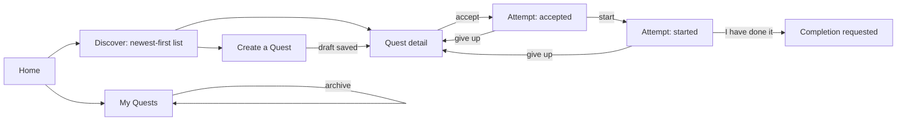

# Mobile Quests UX (Phase 02)

Implemented in `apps/mobile` (expo-router) under `app/(app)/quests/`, with the feature code in
`src/features/quests/`. The client never decides whether a Quest may be published or accepted: it
offers the action and renders the server's answer. That keeps one authority for safety and
eligibility, and means a stale phone cannot talk itself into an attempt it is not allowed to make.

## Flow

| Screen       | Route                    | Notes                                                                                                         |
| ------------ | ------------------------ | ------------------------------------------------------------------------------------------------------------- |
| Discover     | `(app)/quests`           | plain newest-first list, 20 per load; links to My Quests and the composer; footer states "not ranked"         |
| Quest detail | `(app)/quests/[questId]` | full instructions, safety callout, time and evidence; the participant's accept/start/complete/cancel controls |
| Composer     | `(app)/quests/new`       | creates a `DRAFT` only; validated against the shared zod contracts before the request                         |
| My Quests    | `(app)/quests/mine`      | owner list with the two-step check → publish flow, plus archive                                               |

Home (`(app)/index`) links to Discover and My Quests; the composer is reached from Discover. Every
screen is registered in `(app)/_layout.tsx` with a plain title.

## Discovery

`QuestsScreen` calls `GET /v1/quests` with a limit of 20 and renders whatever comes back. It has
three states: loading (a live-region progress indicator reading "Loading Quests…"), loaded, and
empty. A failed load shows the mapped error and falls back to the empty state, which offers "Try
again" rather than leaving a blank screen. There is no pull-to-refresh and no infinite scroll yet;
the list shows the first page.

The footer line "Newest first — not ranked" is deliberate copy, not a placeholder. Ranking and
recommendation belong to a later phase, and implying a ranking that does not exist would misdescribe
the product to its first users.

`QuestCardRow` shows only what the API returned for this viewer: title, two-line summary, and tags
for category, difficulty and effort in minutes. A Quest that is not `PUBLISHED` gets a state tag in
the warning colour (this only occurs in the owner list, which reuses the same row), and a Quest the
viewer already has an active attempt on gets an "accepted" tag. A safety warning from the assessment
is rendered underneath. Nothing is computed client-side — the badge, the state and the participation
flag all come from the response.

## Quest detail and the attempt

The detail screen loads the Quest and, in parallel, the caller's own attempts (`GET
/v1/me/participations`, first 50) to find an active one for this Quest. While the Quest is missing
it shows either the loading indicator or a self-contained "Quest unavailable" screen carrying the
mapped error — which is what a 404 for an age-gated, private or withdrawn Quest looks like on the
phone, since the API hides those rather than explaining them.

The body is ordered the way somebody deciding whether to do something reads it: title and owner, the
summary, then the safety warning callout if the assessment produced one, "What to do", "Stay safe"
(only when the owner wrote safety notes), "Time" (effort minutes and the hours to finish once
started), and "Evidence you will need". The owner additionally sees a "Before you can publish"
section, because `publishBlockers` is returned only to them.

The action area depends on the attempt state.

- No attempt: a single "Accept this Quest" button. It sends `expectedPublishedVersion` from the
  Quest it just displayed, so accepting a version the owner has since replaced fails rather than
  silently binding the participant to different terms.
- `ACCEPTED`: "Start now", plus "Give up for now".
- `STARTED`: "I have done it", plus "Give up for now".
- `COMPLETION_REQUESTED`: no actions, and the line "Evidence and verification arrive in a later
  release." The state is terminal in Phase 02 and the screen says so instead of implying a pending
  review that nothing will perform.

Every action is disabled while its request is in flight, and its failure is shown in the shared
error line rather than in an alert. Errors are mapped by stable API code (`describeError`):
conflicts and forbidden responses show the server's message, rate limiting shows "Too many attempts.
Please wait a moment and try again.", and network or timeout failures show "Cannot reach QUEST right
now. Check your connection." Nothing shows a raw 5xx message.

## Composer

The composer creates a draft and nothing else, so nobody publishes by accident from a create form;
the header copy says "Saved as a draft. You will run a safety check before anyone else can see it."
On success it replaces the route with the new Quest's detail screen.

It exposes title, summary, what to do, optional safety notes, category (fetched from
`GET /v1/quest-categories`), difficulty, audience band, one evidence type, effort in minutes, and
hours to finish once started. Audience is phrased in plain language — "anyone 13+", "16 and over",
"adults only" — because the band names are a data model, not a sentence an author should have to
decode. Trust & Safety may tighten that choice at publication; it can never loosen it.

Validation runs through the same `@quest/types` contracts the API uses (`validateQuestForm`), so an
author gets an error next to the field instead of a round trip, and the phone and the server cannot
disagree about what a valid Quest is. The API re-validates everything regardless. If the category
request fails, the category chips are simply absent and the form cannot be submitted valid — the
screen does not invent a fallback taxonomy.

## My Quests: check, then publish

The owner list loads the caller's Quests in every state and then fetches full detail for each row,
because `contentHash` and `publishBlockers` exist only on the detail response and both are needed
before publishing is offered.

Each row shows the state, a one-line summary from `publishSummary` — either "Ready to publish" or
the first blocker — and then every blocker in full. Publishing is offered only when detail has
loaded, there are no blockers, and the Quest is not already published. "Run safety check" is offered
for anything that is neither published nor archived; "Archive" for anything published. The publish
call sends the `contentHash` the client just read, and refuses locally with "Reload this Quest and
try again." if it does not have one, which is the client-side half of the publish-while-editing
guard.

Blocker copy lives in `src/features/quests/publish-blockers.ts` and is a translation layer only —
it never decides anything.

- `NO_SAFETY_ASSESSMENT` — "Ask for a safety check before publishing."
- `SAFETY_ASSESSMENT_STALE` — "You changed the Quest since its safety check. Run the check again."
- `SAFETY_ASSESSMENT_EXPIRED` — "The safety check has expired. Run it again."
- `SAFETY_UNASSESSED` — "This Quest has not been checked yet."
- `SAFETY_REVIEW_REQUIRED` — "A moderator needs to review this Quest before it can be published."
- `SAFETY_REJECTED` — "This Quest cannot be published as written. Edit it and check again."
- `SAFETY_ESCALATED` — "This Quest cannot be published. Our safety team has been notified."
- `SAFETY_RESTRICTED` — "This Quest can only be published with an age restriction."
- `CONTENT_HASH_MISMATCH` — "This Quest changed somewhere else. Reload it and try again."
- `OWNER_EMAIL_NOT_VERIFIED` — "Verify your email address before publishing a Quest."
- `OWNER_NOT_ACTIVE` — "Your account cannot publish Quests right now."
- `NOT_OWNER` — "Only the owner can publish this Quest."
- `INVALID_STATE_IN_REVIEW` — "This Quest is waiting for a moderator. Edit it to take it back to draft."
- `INVALID_STATE_PUBLISHED` — "This Quest is already published."
- `INVALID_STATE_ARCHIVED` — "Archived Quests cannot be published."
- `INVALID_STATE_SUSPENDED` — "This Quest was withdrawn by our safety team."
- `INVALID_STATE_ERASED` — "This Quest no longer exists."

Duplicate sentences are collapsed, because two codes can map to the same explanation. An unknown
code falls back to "This Quest cannot be published yet." rather than being dropped: silently hiding
a blocker would render a "Ready to publish" row that is not true. The gate's rarest blocker,
`SAFETY_AGE_RESTRICTION_UNSUPPORTED`, has no bespoke sentence yet and takes that fallback.
A "Refresh" button at the foot of the screen reloads the whole list.

The same file holds eligibility copy (`describeEligibilityReason`) for acceptance refusals —
`AUTHENTICATION_REQUIRED`, `BLOCKED`, `OWNER_CANNOT_PARTICIPATE`, `QUEST_NOT_PUBLISHED`,
`OUTSIDE_AVAILABILITY_WINDOW`, `EMAIL_NOT_VERIFIED`, `AGE_RESTRICTED`, `COUNTRY_BLOCKED` and
`COUNTRY_NOT_ALLOWED`, with the same safe fallback. It is unit-tested but not yet wired into a
screen: the detail screen currently shows the API's own 403 message through `describeError`.

## Session handling

`useQuests` builds a typed `questsApi` client over the same base URL and reads the access token from
the Phase 01 `AuthStore` session, so refresh and sign-out stay in Identity and the Quest feature
never touches tokens or storage. Every call goes through `withAuthRetry`, which retries exactly once
after a 401.

## Accessibility

The affordances present in the code today are: buttons expose `accessibilityRole="button"` with a
disabled `accessibilityState` and a 48 pt minimum height; text inputs carry an `accessibilityLabel`
from their visible label and a 48 pt minimum height, with field errors in a polite live region;
form-level errors are an assertive live region; loading states expose `accessibilityRole=
"progressbar"` with a label and a polite live region; the composer's choice chips are radios with a
selected state, a label of the form "Category: fitness", and a 44 pt minimum height; Quest cards
expose a link role and an `accessibilityLabel` combining title and summary. Colours come from the
`@quest/ui` tokens through the mobile theme.

## Deliberately absent in Phase 02

There is no XP, no level, no badge, no streak, no leaderboard and no ranking anywhere in these
screens, and no social layer — no following, comments, sharing or crews. Discovery is a flat list by
recency. Nothing on the completion path awards anything: an attempt ends at "completion requested"
and the screen says verification arrives later. These are not oversights; adding a reward surface
before proof verification exists would reward claims rather than actions.

Also not present yet, and tracked rather than hidden: there is no edit screen (the API's `PUT
/v1/quests/:questId` has no caller on mobile, so an author revises nothing after the draft is
saved), no separate list of the caller's own attempts, and no controls for visibility, availability
windows, country rules, evidence count or location attestation — the composer sends `PUBLIC`
visibility and a single evidence item. Component rendering tests are still outstanding (TD-06); the
Quest feature's logic is covered by unit tests in `src/features/quests/quests.test.ts`.
